# bookcar

This application is A template for displaying the ux/ui of the booking application. No user data is accessed at all.
We create a real working screen to be used when building a real application.

## Getting Started

This project is a starting point for a Flutter application.

A few resources to get you started if this is your first Flutter project:

- [Lab: Write your first Flutter app](https://docs.flutter.dev/get-started/codelab)
- [Cookbook: Useful Flutter samples](https://docs.flutter.dev/cookbook)

For help getting started with Flutter development, view the
[online documentation](https://docs.flutter.dev/), which offers tutorials,
samples, guidance on mobile development, and a full API reference.

  

  

## Splash Screen

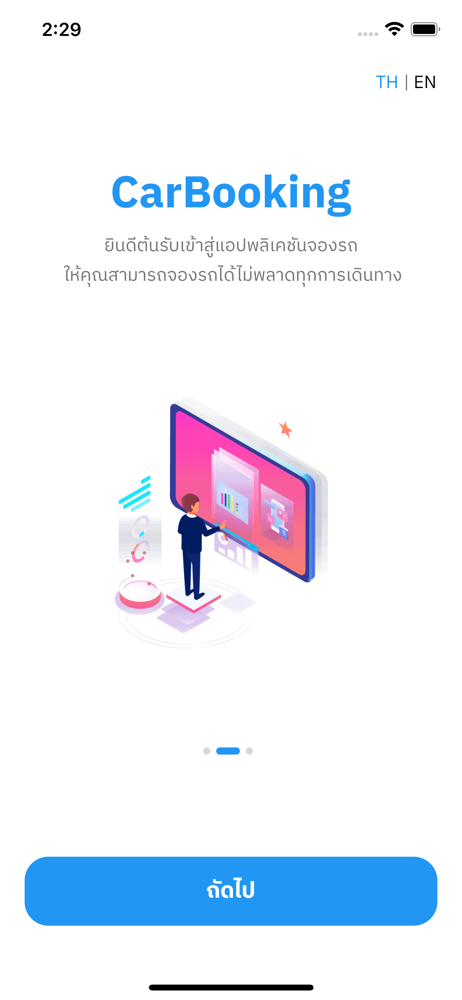
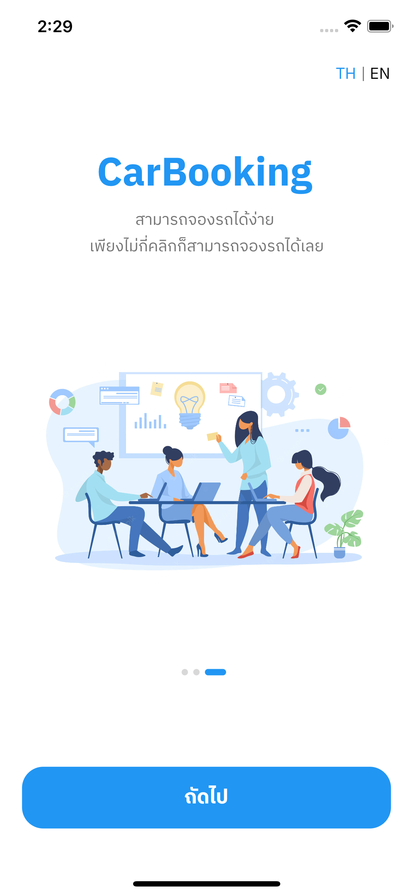

## Register & Signin Screen

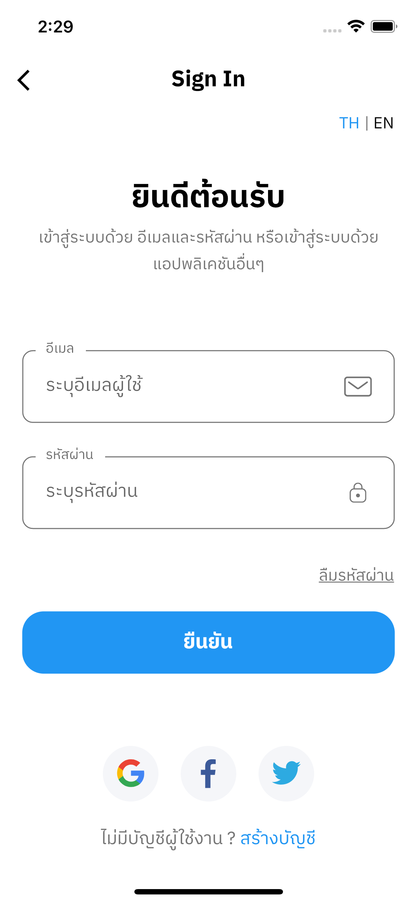
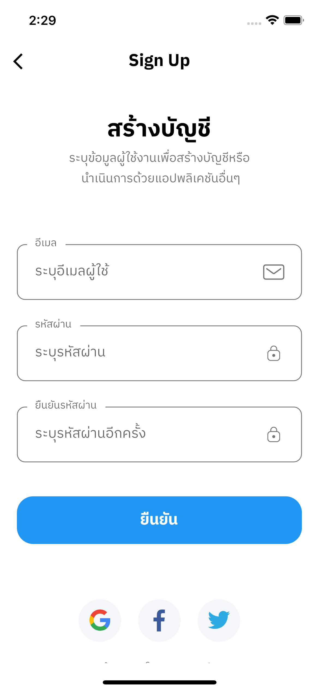
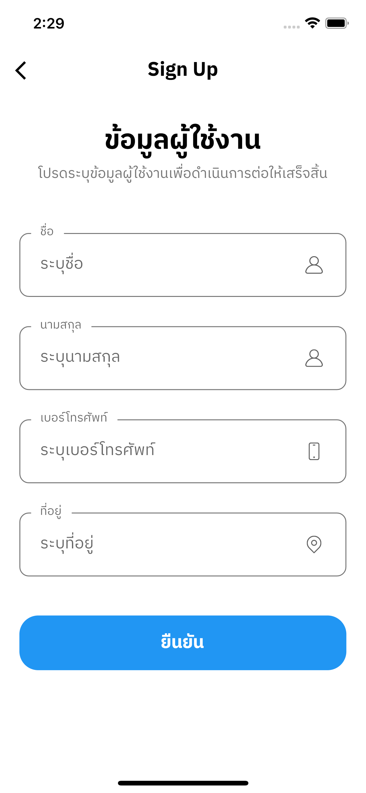

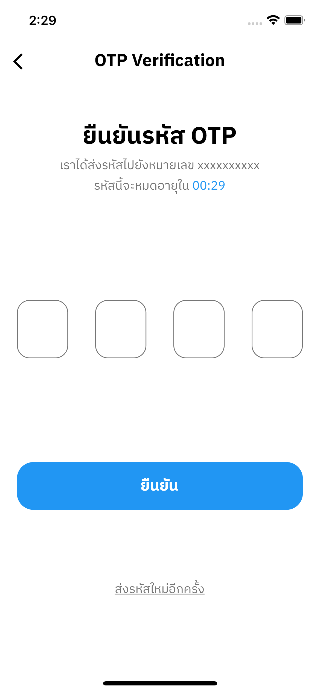
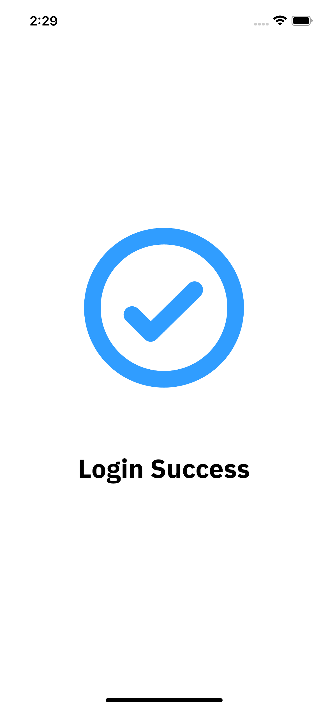

## Menu & Profile Screen

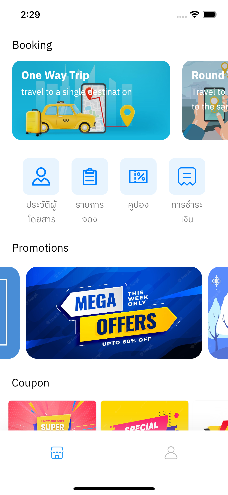
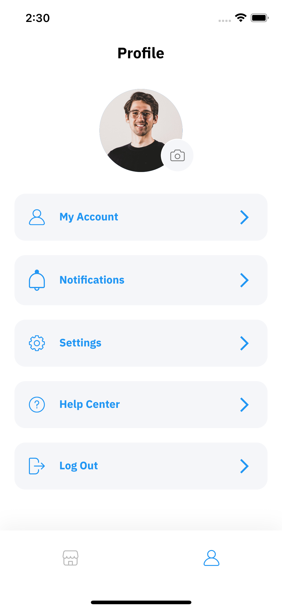

## Booking Screen

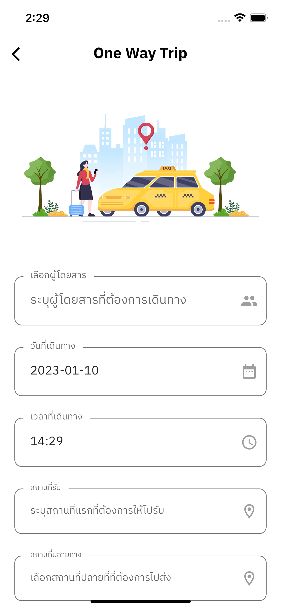
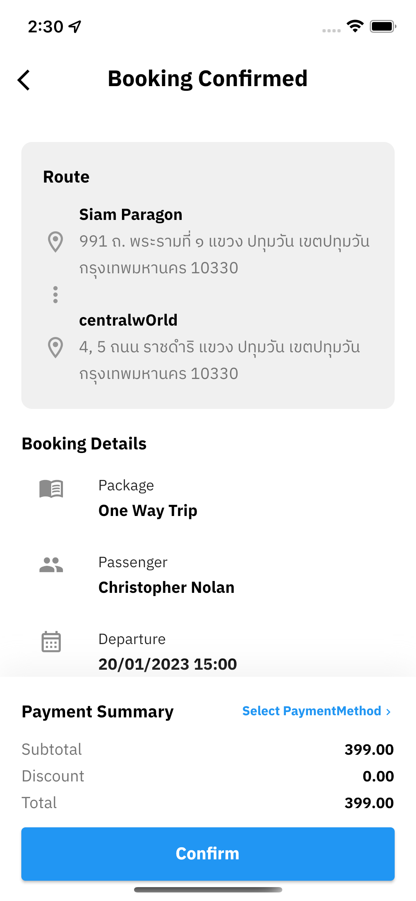
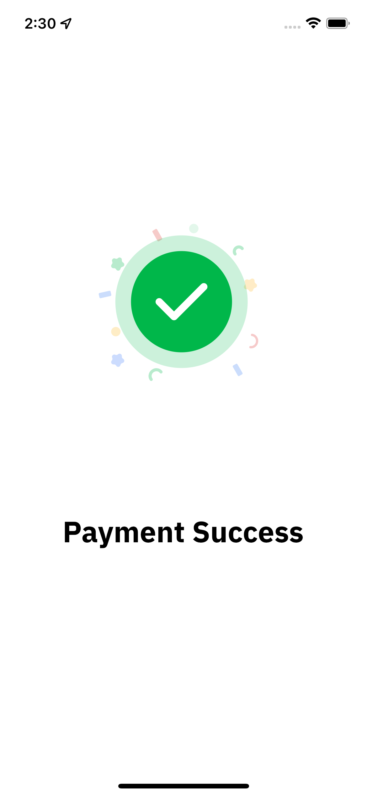

## Passenger Profile & Booking List & Coupon  Screen

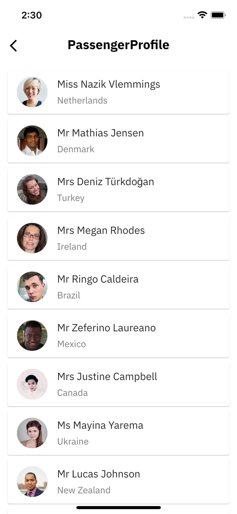
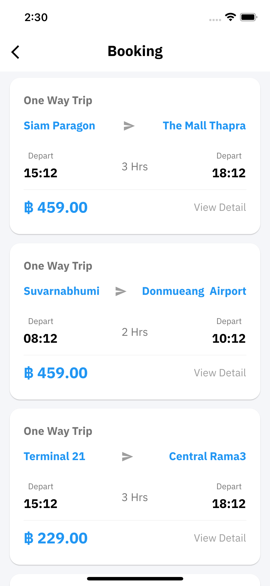
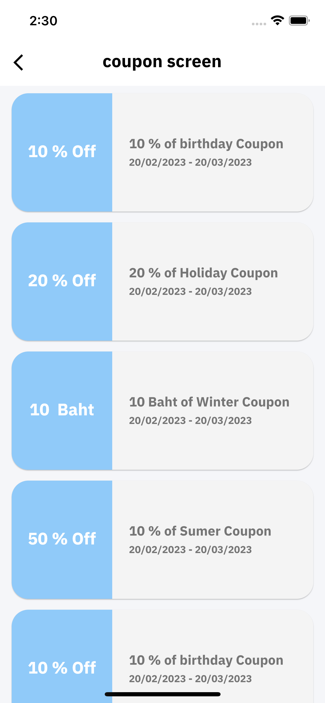

## History Screen

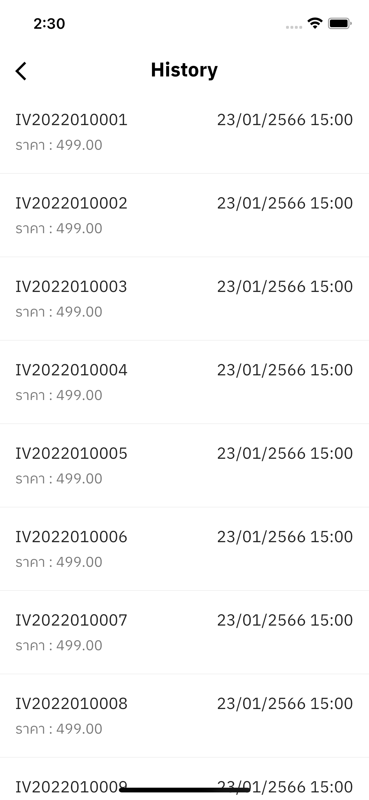
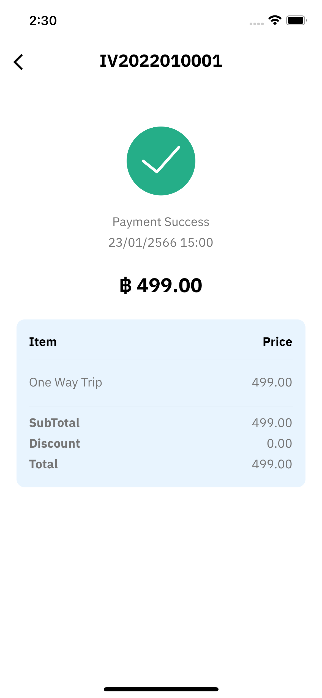

<!-- 
 -->
